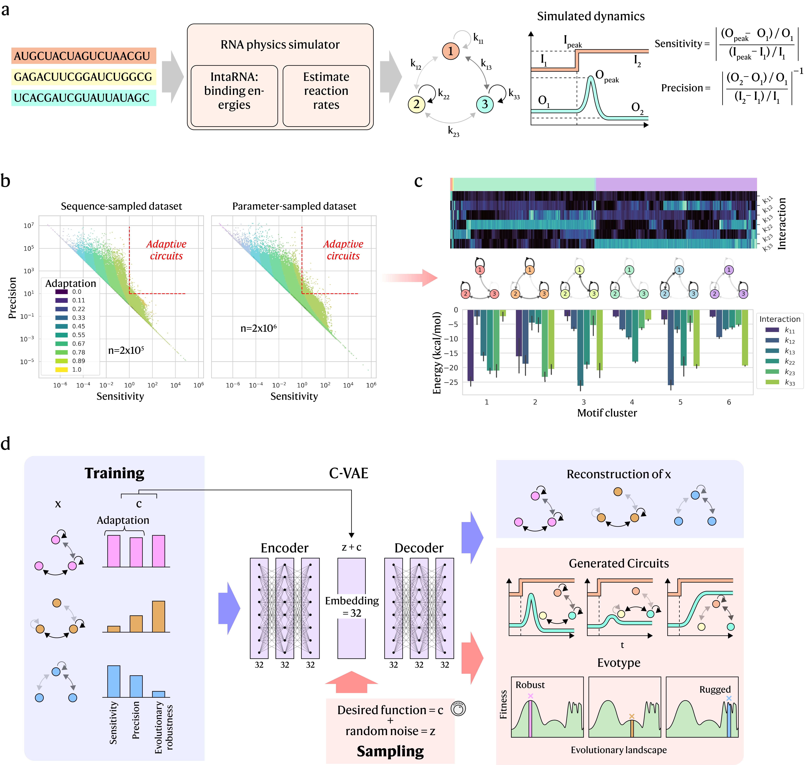

# EvoScaper

Pre-print: Generative design of synthetic gene circuits for functional and evolutionary properties ([BioRxiv](https://www.biorxiv.org/content/10.1101/2025.09.26.678595v1))

## Usage

This repository contains all the code used to train neural networks on simulated genetic circuit dynamics and the notebooks used for analysis in the paper. The `src/evoscaper` repository contains scripts for simulating circuits, initialising the conditional variational autoencoder (CVAE) model, training batches of models, and verifying that generated circuits adhere to the function they were prompted with. 

